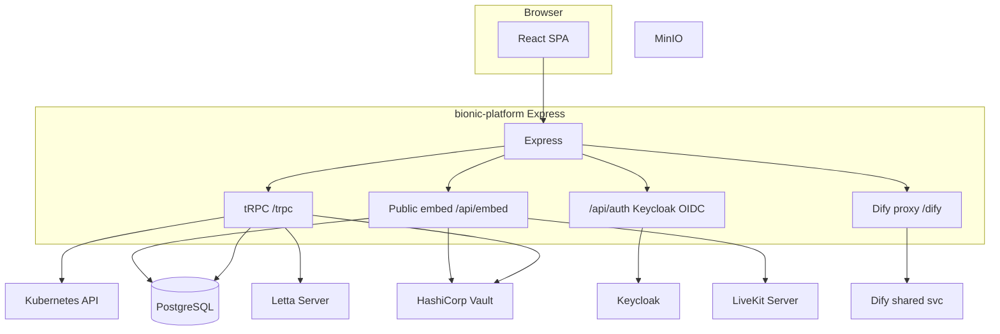

# Architecture

## High-level diagram

## Request lifecycle (tRPC)

1. Browser calls `POST /trpc/<namespace>.<procedure>?batch=1` with a JSON body.
2. `createExpressMiddleware` in `server/index.ts` builds context via `createContext` in `server/_core/trpc.ts`: reads session cookie to `SessionUser | null`, connects the DB pool.
3. Procedure middleware enforces auth (`protectedProcedure`, `adminProcedure`, `appScopedProcedure`, `analystOrAdminProcedure`).
4. Router handlers use Drizzle on tables defined in `drizzle/platformSchema.ts`.

## Session model

- After Keycloak callback, the server sets an HttpOnly cookie `bp_session` containing a **signed JWT** (HS256) with user fields (`server/_core/auth.ts`).
- `getUserFromRequest` reads that cookie for API routes and tRPC context.

## Multi-tenancy model

- **App** = tenant (`apps` table, unique `slug`).
- **Membership** = `app_members` ties Keycloak `sub` to `appId` with `owner` or `member`.
- **Kubernetes**: optional per-app namespace equals `slug` (`server/services/provisioner.ts`, `server/k8sClient.ts`).
- **Vault**: per-app secrets at `secret/data/t6-apps/<slug>/config` (`server/vaultClient.ts`).

## Background and async work

- **Provisioning jobs** run asynchronously after app create (`runProvisioningJob` from `server/appRouter.ts`).
- **Document ingestion** after `POST /api/agents/:id/documents` runs an async IIFE in-process (no queue). A pod restart can interrupt in-flight work; see `server/index.ts`.

## Static assets

- Production serves the built SPA from `dist/public` (`server/index.ts`), with SPA fallback to `index.html`.
